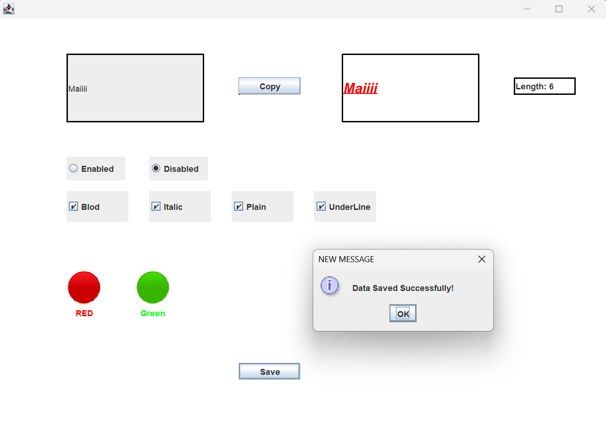

# 📌 Java Swing Event Handling Demo

## 📖 Description
This project is a simple GUI application built using **Java Swing** that demonstrates handling different types of events such as:
- Action Events (Buttons)
- Item Events (Checkboxes)
- Mouse Events
- Keyboard Events

---

## ✨ Features
- 📝 Copy text from TextField to Label  
- 🎨 Change text color (Red / Green) using clickable icons  
- 🔤 Apply font styles:
  - Bold
  - Italic
  - Plain
  - Underline  
- 🔘 Enable / Disable text field using Radio Buttons  
- 🖱️ Detect selected text length  
- ⌨️ Move label using arrow keys  
- 💾 Save button with confirmation message

---

## 🧩 Components Explanation

### 🪟 JFrame (Main Window)

* The main container of the application.
* Holds all UI components.
* Set with:

  * Title
  * Size
  * Layout (null for absolute positioning)

---

### 📦 JPanel

* Used to organize components inside the frame.
* Acts as a container for all elements.
* Allows better control over layout and background color.

---

### 📝 JTextField

* Input field where the user writes text.
* Can be:

  * Enabled (editable)
  * Disabled (read-only)

---

### 🔘 JButton

* Used for actions like:

  * **Copy** → copies text to label
  * **Save** → shows confirmation message
* Works with `ActionListener`.

---

### 🏷️ JLabel

* Displays text or images.
* Used for:

  * Showing copied text
  * Displaying color icons (red/green)
* Can be styled (font, color, border).

---

### 🔘 JRadioButton

* Used to select **one option only**:

  * Enable
  * Disable
* Grouped باستخدام `ButtonGroup`.

---

### ☑️ JCheckBox

* Allows multiple selections:

  * Bold
  * Italic
  * Plain
  * Underline
* Controls font style dynamically.

---

### 🖼️ ImageIcon

* Used to display images (red & green circles).
* Images are resized using:

  * `getScaledInstance()`

---

### 🖱️ MouseListener

* Detects mouse clicks on:

  * Images
  * Labels
* Changes text color based on selection.

---

### ⌨️ KeyListener

* Detects keyboard input.
* Arrow keys are used to:

  * Move the label across the screen.

---

### 📩 JOptionPane

* Displays pop-up messages.
* Used for:

  * Save confirmation dialog.

---

## 🛠️ Technologies Used

* Java
* Swing
* AWT

---

## 🛠️ Technologies Used
- Java  
- Java Swing  
- AWT Event Handling  

---

## 🧠 Concepts Covered
- Event Listeners:
  - ActionListener
  - ItemListener
  - MouseAdapter
  - KeyListener
- GUI Components:
  - JFrame, JPanel, JButton, JLabel, JTextField
- Handling user interaction

---

## 📂 Project Structure
```
events/
 └── event.java
 └── Main.java
Images/
 ├── red.png
 └── green.png
```

---

## ▶️ How to Run
1. Open the project in any IDE (IntelliJ / Eclipse)  
2. Make sure the `Images` folder is in the correct path  
3. Run `event.java`

---

## 📸 Preview
<p align="center">
  
</p>

---

## 💡 Notes
- Make sure images path is correct (`Images/red.png`, `Images/green.png`)
- The project is for learning purposes and practicing event handling
